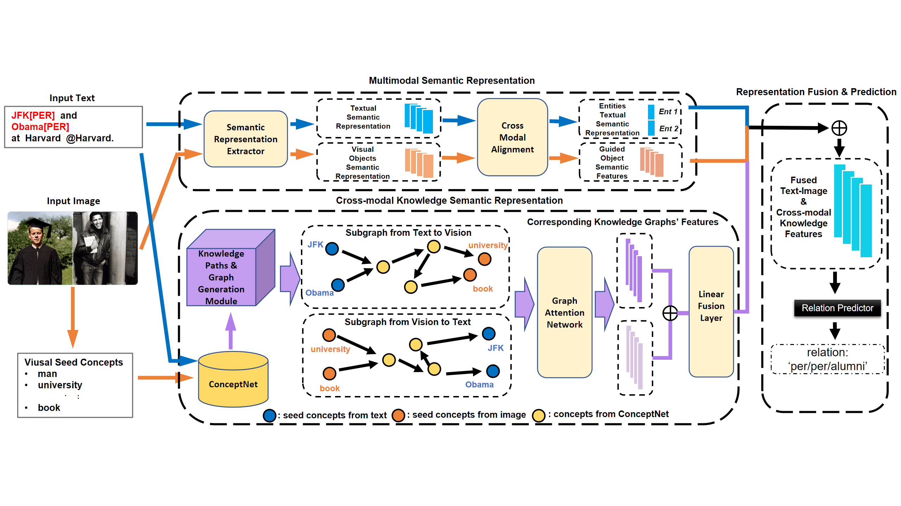

# Source Code of RECK for Multimodal Relation Extraction
Official Implementation of our Paper ["Towards Bridged Vision and Language: Learning Cross-modal Knowledge Representation for Relation Extraction"](https://ieeexplore.ieee.org/abstract/document/10147282) in IEEE Transactions on Circuits and Systems for Video Technology.

## Motivation
We bridge semantic gaps between low-level visual objects and high-level textual relations with Cross-modal Knowledge graphs. We also provide some direct evidences for relation extraction. As a result, our method can generate the correct relations with corresponding reasons.

## Model Architecture

The overall framework of our proposed RECK model which introduces external knowledge to help predict textual relations. Three main modules are designed for multimodal semantic representation, cross-modal knowledge semantic representation, and final feature fusion and relation prediction. We construct the cross-modal knowledge graphs as a bridge to vision and language, thus the inconsistency problem of semantic levels can be addressed for precise relation identification.

## Required Environment

Our model is based on the framework of [OpenNRE](https://github.com/thunlp/OpenNRE). Please follow the instructions from their repository.
```
pip install opennre
```

## Data Preparation

You need to download two kinds of data to run the code.

1. The raw images of [MNRE](https://github.com/thecharm/MNRE).
2. The visual objects from the raw images from [HVPNeT](https://github.com/zjunlp/HVPNeT), many thanks.
3. The extracted conceptnet_vocab data can be found [here](https://drive.google.com/file/d/1zet1meEQq7gWzTddroQ_oE72JWJafBv9/view?usp=sharing).


You should specify the "root_path2" in ``run.py`` with the path of the raw images and objects.

## Path Structure
The expected structures of Paths are:

```
 |-- ckpt # save the checkpoint
 |    |-- best.pth.tar  # we provide the model checkpoint for inference, you can also run the training code to get the same ckpt
 |-- data
 |    |-- concept_data  # the extracted knowledge paths (v2t, t2v & t2t graphs)
 |    |    |-- val_0-5_v2t_entity.json
 |    |    |-- val_0-5_t2v_entity.json
 |    |    |-- val_0-5_t2t_entity.json
 |    |    |-- test_0-5_v2t_entity.json
 |    |    |-- test_0-5_t2v_entity.json
 |    |    |-- test_0-5_t2t_entity.json
 |    |    |-- train_0-5_v2t_entity.json
 |    |    |-- train_0-5_t2v_entity.json
 |    |    |-- train_0-5_t2t_entity.json
 |    |-- txt  # text data
 |    |    |-- ours_train.txt # input data
 |    |    |-- ours_val.txt
 |    |    |-- ours_test.txt
 |    |    |-- mre_train_dict.pth  # {imgname: [object-image]}
 |    |    |-- ...
 |    |-- ours_rel2id.json # relation types
 |-- opennre	# main framework 
 |    |-- encoder # main model
 |    |    |-- bert_encoder.py # RECK model
 |    |    |-- modeling_bert.py
 |    |-- framework # processing files
 |    |    |-- data_loader.py # data processor, we read the concept paths here
 |    |    |-- sentence_re.py # trainer
 |    |    |-- utils.py
 |    |-- model # classifier
 |    |    |-- softmax_nn.py # main classifier
 |    |    |-- modeling_bert.py 
 |    |    |-- base_model.py # supporting the classifier, no modification required
 |    |-- tokenization # tokenizers, no modification required
 |    |-- pretrain.py # basic file
 |    |-- utils.py # basic file
 |-- opennre.egg-info
 |-- results # saving the results
 |    |-- test # results for test set
 |    |-- val # results for validation set
 |-- run.py   # main
```

## Model Training
The data path and GPU-related configuration are in the `run.py`. To train RECK, run the script:
```
python run.py --ckpt /path/to/your/checkpoint
```
The ckpt path can be simply set as "best" or "first".

## Model Testing
To evaluate our model in the test set, simply run:
```
python run.py --ckpt best --only_test True
```
## Implementation Results vs. Reported Results 
|                       | **Precision** | **Recall** | **F1**    |
|:---------------------:|:----------:   |:--------:  |:---------:|
| **Reported Results**  | 88.77         | 88.91      | 88.84     |
| **Implementation Results** | 89.48         | 89.06      | 89.27     |

You can simply get the best results by runing the training code without changing any hyper-params.

## Citation

If you find this repo helpful, please cite the following:
``` latex
@article{feng2023towards,
  title={Towards Bridged Vision and Language: Learning Cross-modal Knowledge Representation for Relation Extraction},
  author={Feng, Junhao and Wang, Guohua and Zheng, Changmeng and Cai, Yi and Fu, Ze and Wang, Yaowei and Wei, Xiao-Yong and Li, Qing},
  journal={IEEE Transactions on Circuits and Systems for Video Technology},
  year={2023},
  publisher={IEEE}
}
```

