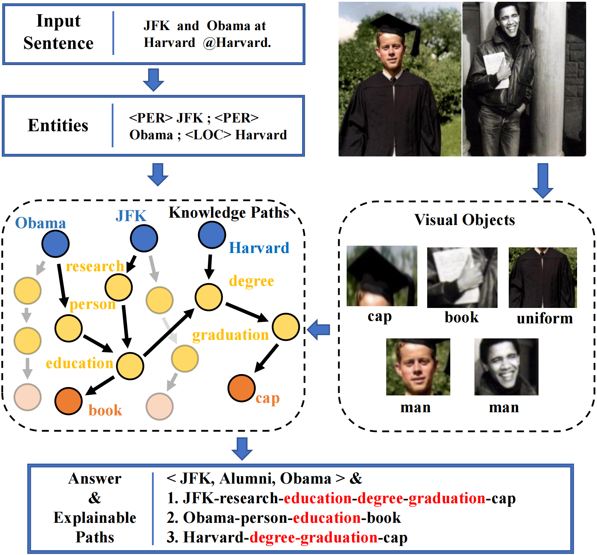

# Source Code of RECK for Multimodal Relation Extraction
Official Implementation of our Paper ["Towards Bridged Vision and Language: Learning Cross-modal Knowledge Representation for Relation Extraction"](https://ieeexplore.ieee.org/abstract/document/10147282) in IEEE Transactions on Circuits and Systems for Video Technology.

## Motivation


We bridge semantic gaps between low-level visual objects and high-level textual relations with Cross-modal Knowledge graphs. We also provide some direct evidences for relation extraction. As a result, our method can generate the correct relations with corresponding reasons.


## Model Architecture


The overall framework of our proposed RECK model which introduces external knowledge to help predict textual relations. Three main modules are designed for multimodal semantic representation, cross-modal knowledge semantic representation, and final feature fusion and relation prediction. We construct the cross-modal knowledge graphs as a bridge to vision and language, thus the inconsistency problem of semantic levels can be addressed for precise relation identification.

## Required Environment

Our model is based on the framework of ["OpenNRE"](https://github.com/thunlp/OpenNRE). Please follow the instructions from their repository.
```
pip install opennre
```

## Data Preparation

You need to download two kinds of data to run the code.

1. The raw images of [MNRE](https://github.com/thecharm/MNRE).
2. The visual objects from the raw images from [HVPNeT](https://github.com/zjunlp/HVPNeT), many thanks.

You should specify the "root_path2" in ``run.py`` with the path of the raw images and objects.

## Path Structure
The expected structures of Paths are:

```
 |-- ckpt # save the checkpoint
 |    |-- best.pth.tar  # we provide the model checkpoint for inference, you can also run the training code to get the same ckpt
 |-- data
 |    |-- concept_data  # the extracted knowledge paths

